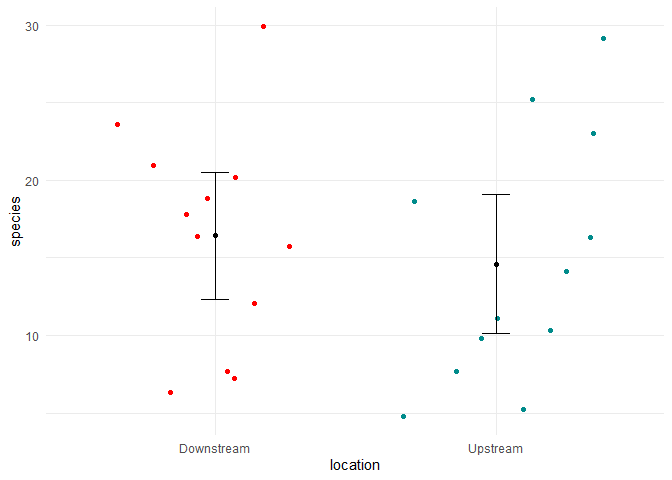

Lab 6 Comparing two means
================
Tyler Edvall
04/22/21

Researchers studying the number of electric fish species living in
various parts of the Amazon basin were interested in whether the
presence of tributaries affected the local number of electric fish
species in the main rivers (Fernandes et al. 2004).

They counted the number of electric fish species above and below the
entrance point of a major tributary at 12 different river locations.

The data is provided in your GitHub repository.

For each question below, write a sentence answering the question and
show the code you used to come up with the answer, if applicable.

## Question A

> What is the mean difference in the number of species between areas
> upstream and downstream of a tributary? What is the 95% confidence
> interval of this mean difference. Show your code and write a sentence
> giving your answer

``` r
# load packages -----------------------------------------------------------

library(tidyverse)
```

    ## -- Attaching packages --------------------------------------- tidyverse 1.3.1 --

    ## v ggplot2 3.3.3     v purrr   0.3.4
    ## v tibble  3.1.1     v dplyr   1.0.5
    ## v tidyr   1.1.3     v stringr 1.4.0
    ## v readr   1.4.0     v forcats 0.5.1

    ## -- Conflicts ------------------------------------------ tidyverse_conflicts() --
    ## x dplyr::filter() masks stats::filter()
    ## x dplyr::lag()    masks stats::lag()

``` r
# read data ---------------------------------------------------------------

fish <- read_csv("chap12q19ElectricFish.csv")
```

    ## 
    ## -- Column specification --------------------------------------------------------
    ## cols(
    ##   tributary = col_character(),
    ##   speciesUpstream = col_double(),
    ##   speciesDownstream = col_double()
    ## )

``` r
fish_long <- 
  pivot_longer(fish, speciesUpstream:speciesDownstream,
               names_to = "location",
               values_to = "species") %>% 
  mutate(location = str_remove(location, c("species"))) %>% 
  print()
```

    ## # A tibble: 24 x 3
    ##    tributary location   species
    ##    <chr>     <chr>        <dbl>
    ##  1 Içá       Upstream        14
    ##  2 Içá       Downstream      19
    ##  3 Jutaí     Upstream        11
    ##  4 Jutaí     Downstream      18
    ##  5 Japurá    Upstream         8
    ##  6 Japurá    Downstream       8
    ##  7 Coari     Upstream         5
    ##  8 Coari     Downstream       7
    ##  9 Purus     Upstream        10
    ## 10 Purus     Downstream      16
    ## # ... with 14 more rows

``` r
# data compiling ----------------------------------------------------------------

fish_long_summary <-
  fish_long %>% 
  group_by(location) %>% 
  summarize(
    n = n(),
    mean = mean(species),
    sd = sd(species),
    sem = sd/sqrt(n),
    upper = mean + 1.96 * sem,
    lower = mean - 1.96 * sem
  ) %>% 
  print()
```

    ## # A tibble: 2 x 7
    ##   location       n  mean    sd   sem upper lower
    ##   <chr>      <int> <dbl> <dbl> <dbl> <dbl> <dbl>
    ## 1 Downstream    12  16.4  7.22  2.08  20.5  12.3
    ## 2 Upstream      12  14.6  7.93  2.29  19.1  10.1

``` r
t.test(formula = species ~ location, data = fish_long)
```

    ## 
    ##  Welch Two Sample t-test
    ## 
    ## data:  species by location
    ## t = 0.59249, df = 21.81, p-value = 0.5596
    ## alternative hypothesis: true difference in means is not equal to 0
    ## 95 percent confidence interval:
    ##  -4.587031  8.253697
    ## sample estimates:
    ## mean in group Downstream   mean in group Upstream 
    ##                 16.41667                 14.58333

``` r
16.4-14.6
```

    ## [1] 1.8

The mean difference is 1.8 and the 95% confidence interval of the mean
is -4.587031 and 8.253697 between the number of species in the upstream
versus the downstream areas of the tributaries.

## Question B

> Test the hypothesis that the tributaries have no effect on the number
> of species of electric fish.

The p-value is 0.5596, which is greater than 0.05. This would indicate
that we fail to reject the null hypothesis.

## Question C

> State the assumptions that you had to make to complete parts (A) and
> (B). Create a graph to assess whether one of those assumptions was
> met.

We have to assume that the data is distributed normally and each of the
two samples is a random sample from the population.

``` r
fish_long %>% 
  ggplot(aes(x = species)) +
  geom_histogram(
    aes(fill = location), 
    bins = 15, 
    alpha = 0.5, 
    position = "identity"
  ) +
  scale_fill_manual(values = c("red","cyan4")) +
  theme_minimal()
```

<!-- -->

``` r
fish_long %>% 
  ggplot(aes(x = location, y = species)) +
  geom_jitter(aes(color = location), 
              shape = 16, alpha = 0.3, width = 0.4) +
  geom_errorbar(aes(y = mean, ymax = upper, ymin = lower), 
                data = fish_long_summary, width = .1) +
  geom_point(aes(y = mean), 
             data = fish_long_summary) +
  scale_color_manual(values = c("red","cyan4")) +
  theme_minimal() +
  guides(color = "none")
```

<!-- -->
